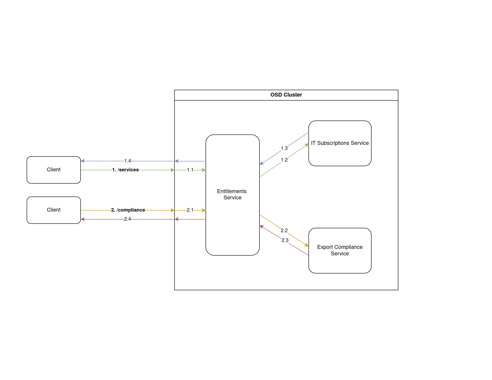

# Entitlements Service

Entitlements service serves as a proxy to various backend Red Hat IT services. It performs the following functions:
* `/subscriptions`: query IT for a list of subscriptions that a user is entitled to
* `/compliance`: query IT for user compliance checks
* ~~`/seats`~~: query AMS from OCM to read, assign, and delete user subscriptions (a seat is considered an Openshift subscription assignable to a user)
    * __OBSOLETE__ - these apis are no longer enabled in prod



## SKU/Bundle changes
- The `/bundles/bundles.example.yml` file in this repo is for **local testing only**
- To run the app, be sure to copy `/bundles/bundles.example.yml` to `/bundles/bundles.yml`
- To make SKU changes for the live service, see the `entitlements-config` repository: https://github.com/RedHatInsights/entitlements-config

## Application Setup

Install Golang:

```sh
sudo dnf install golang # or brew install go on OSX
```

Clone this repo:

```sh
git clone git@github.com:RedHatInsights/entitlements-api-go.git
```

Then, install the project's Go dependencies by running:

```sh
go get ./...
```

Build the project and generate the openapi types and stubs:

```sh
make
```

If your local version differs from what entitlements is using, you can download the desired version of go here: [go.dev/doc/manage-install](https://go.dev/doc/manage-install), and then pass the path to the go binary to all make commands like so:
```sh
make GO=~/go/bin/go1.23
```

## Certificates and Configuration

### Getting an Enterprise Cert

To run the Entitlements API locally, you will need an Enterprise Services cert with access to the dev subscription endpoint /search/criteria and the export compliance service in whatever environment you are testing in.

* You can request a personal cert by following ALL steps in this [doc](https://source.redhat.com/departments/it/identityaccessmanagement/it_iam_pki_rhcs_and_digicert/rhcs_v2_start_your_certificate_journey_here_2023#user-certificates).
* If you need access to export compliance service, you can request access via it-legal-help@redhat.com. Be sure to include the UID of your cert for access. For help from that team, see [here](https://source.redhat.com/groups/public/it-legal-program/restricted_party_screening)
* You can export your crt and key like so:
    `openssl pkcs12 -in your-p12-cert.p12 -out your-key.key -nocerts -nodes`
    `openssl pkcs12 -in your-p12-cert.p12 -out your-cert-sans-key.crt -clcerts -nokeys`

### Create your config file

You'll need to make a config file specific to your machine.
Create a local config directory: `mkdir -p ./local`
Add a file that contains your local configuration options: `$EDITOR ./local/development.env.sh`
The contents should look like this:

```sh
export ENT_KEY=./{path_to_key}.key
export ENT_CERT=./{path_to_cert}.crt
export ENT_CA_PATH=./{path_to_ca_cert}.crt
export ENT_SUBS_HOST=https://subscription.dev.api.redhat.com
export ENT_COMPLIANCE_HOST=https://export-compliance.dev.api.redhat.com
export ENT_DEBUG=true
```

Replace `{path_to_key}` and `{path_to_cert}` with the locations of the `.key` and `.crt` files from the previous section.
ENT_DEBUG will use mock clients for ams and bop, if this is not set to true you will need more config to setup those clients.
See the bop and ams client files for what config is needed.

### Set up your local entitlement bundles

Copy the `/bundles/bundles.example.yml` to `/bundles/bundles.yml` in order to have your local app consume bundle data. You can modify this file for local testing.

**Note:** _This file is for local testing only. If you wish to make changes to the actual bundles, please refer to https://github.com/RedHatInsights/entitlements-config_

## Running the Application

Now that everything is set up, you can run the application using:

```bash
source ./local/development.env.sh
```
then run one of the following

```bash
# this will generate, build, and run the built executable (good for debugging)
make exe
```
or you can also run
```bash
# this will run `go run ...` which will build a stripped down optimized version of the app
make run
```

To run locally with Docker:

```bash
make image
docker run -p 3000:3000 entitlements-api-go
```

## Testing Entitlements API with curl

The Entitlements API requires that you pass in a valid `x-redhat-identity` header or it rejects requests.
For an example see `cat ./scripts/xrhid.sh`

## Testing the bundle-sync

To test the bundle sync behavior, you'll need to configure your environment similar to the instructions above, build the script, and run it against the dev environment:

```bash
source ./local/development.env.sh
make build
./bundle-sync
```

## Running the Unit Tests

* To run the unit tests, execute the following commands from the terminal:
    ```bash
    make test
    ```
* To run the unit tests how they are run in our pr_check builds (generates output files):
    ```bash
    make test-all
    ```
* To include benchmarks:
    ```bash
    make bench
    ```

## Releases

**Versioning:** All releases should follow [SemVer](http://semver.org) versioning.

**Release Tagging:** Releases are drafted with a version, and then `master` is tagged with the version number.
For example, release [`Entitlements v1.16.1`](https://github.com/RedHatInsights/entitlements-api-go/releases/tag/v1.16.1) has a corresponding tag [`v1.16.1`](https://github.com/RedHatInsights/entitlements-api-go/tree/v1.16.1).

**Deployment:** Once a PR merges to master, our [build-main](https://ci.ext.devshift.net/job/RedHatInsights-entitlements-api-go-gh-build-master/) jenkins job will build/deploy an image to `quay.io` and tag it with the commit sha. We then update the image tag of our deployment in app-interface to that same commit SHA.

## Production Deployments

Deployment configuration is stored in [/deployment/clowdapp.yml](/deployment/clowdapp.yml)

### Certificates

In stage and prod, we have 2 ways of deploying our required certs.

#### Automatic Renewal via IT (default method)
AppSRE provides the option to automatically generate and renew certs in our openshift applications.

If `AUTOMATIC_CERTIFICATE_RENEWAL_ENABLED` is set to `true`: the certs will be
automatically placed in the `/certificates` directory, and both the
certificates themselves and the CA certificates will be read from those files.

**IMPORTANT**: if using automatic cert renewal, `ENT_CERTS_FROM_ENV` must be
set to `false`.

If `AUTOMATIC_CERTIFICATE_RENEWAL_ENABLED` is set to `false`: the manual method must be used.

#### Manually via env or files
If `ENT_CERTS_FROM_ENV` is set to `false`: store cert & key data in files, and set `ENT_CERT` and `ENT_KEY` to the locations of those files for the appliation to load.

If `ENT_CERTS_FROM_ENV` is set to `true`: store cert & key data in the env vars `ENT_CERT` and `ENT_KEY` directly.
